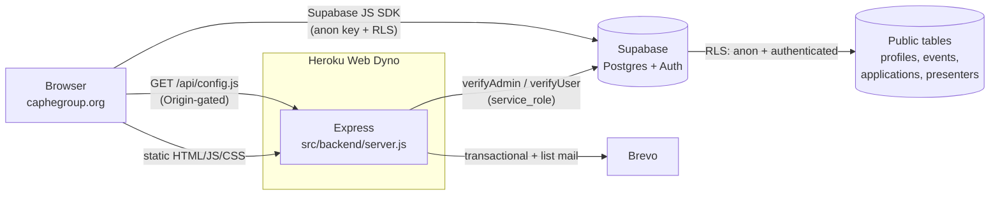

# CAPHE — caphegroup.org

[](https://caphegroup.org)
[](LICENSE)
[](#tech-stack)

Full-stack platform for the **California Association of Public Health Economists**. Shared analytical infrastructure for a research community that has not had one: 37 interactive methods labs, 2 production calculators, member directory, peer-review program, and the editorial pipeline that runs behind it.

## Why this exists

California public health economists work in fragmented institutions: county departments, managed care plans, university centers, CBOs. They use shared methods, but they do not share infrastructure for teaching, replicating, or auditing those methods. CAPHE is the small piece of common infrastructure that closes that gap. The platform is built around three things the community kept asking for: a place to publish reproducible methods labs, two operational calculators that surface the same evidence base in different forms, and a member-driven peer-review program that runs every other month.

## What's in the box

### Production calculators (2)

- **[Medi-Cal Access Explorer](https://caphegroup.org/tools/access-explorer/)** — county-level access maps with on-the-fly filtering and benchmarking. Source: `public/tools/access-explorer/`.
- **[Public Health ROI Calculator](https://caphegroup.org/tools/lha-calculator/)** — Local Health Authority return-on-investment estimator with documented methodology page. Source: `public/tools/lha-calculator/`.

### Methods labs (37)

Interactive single-page labs in `public/methods-lab/`. Each lab is a self-contained HTML/JS lesson built around one decision a working public health economist makes, with worked examples and runnable parameters.

<details>
<summary>Full lab list (click to expand)</summary>

**Causal inference foundations.** counterfactual-basics, correlation-causation-interactive, classifying-causal-mechanisms, study-design-ladder, observational-to-experimental, control-groups-not-enough.

**Threats to identification.** confounding-assessment-checklist, threat-confounding-selection, selection-into-treatment, collider-bias, threat-measurement-instrumentation, measurement-error-claims, threat-history-events, threat-history-maturation, threat-history-solutions, threat-maturation-solutions, threat-maturation-trends, threat-regression-to-mean, reverse-causation-feedback, before-after-trap, identical-data-opposite-policies.

**Design and inference.** parallel-trends-power, comparator-choice, comparing-two-programs, p-hacking-multiple-testing, regression-tables-confounding, geographic-variables.

**Cost-effectiveness and outcomes.** measuring-health-common-unit, cost-effectiveness-ratio, cea-uncertain-effects, decision-thresholds, sensitivity-analysis-cea, budget-impact.

**Applied cases.** medicaid-expansion, chw-health-outcomes, food-insecurity-diabetes, why-it-works-isnt-enough.

</details>

### Member system

LinkedIn + Google + email/password auth via Supabase. Tier-gated content: community labs are public; professional labs require active membership. Membership applications, peer-review participation, and event signups flow through the same Postgres schema. Brevo integration handles transactional and list email.

## Tech stack

| Layer | Tech |
|---|---|
| Frontend | HTML5, vanilla JS, CSS — no framework, no build step |
| Backend | Node.js, Express |
| Auth | Supabase Auth + LinkedIn/Google OAuth |
| Database | Postgres on Supabase, with RLS on every table |
| Email | Brevo (transactional + list) |
| Hosting | Heroku (web dyno, auto-cert mgmt) |
| DNS | Cloudflare in front of `caphegroup.org` |

## Architecture



## Security model

- The **anon key** is delivered to clients only by `GET /api/config.js`, which is gated by an `Origin`/`Referer` host allowlist (caphegroup.org + localhost). The key never appears in static HTML or in this repo.
- The **service_role key** is server-side only, never reaches the client, and is only used inside the `verifyAdmin`/`verifyUser` middleware paths.
- All tables enforce **row-level security**. The anon key alone grants only the access RLS policies allow.
- OAuth flows (LinkedIn, Google) are handled server-side and exchange tokens for a Supabase session that is then handed to the client.

## Local development

```bash
git clone https://github.com/dphdame/caphe-website.git
cd caphe-website

# Install dependencies
npm install

# Configure environment
cp .env.example .env
# Edit .env: SUPABASE_URL, SUPABASE_ANON_KEY, SUPABASE_SERVICE_ROLE_KEY,
# BREVO_API_KEY, LINKEDIN_CLIENT_ID, LINKEDIN_CLIENT_SECRET,
# GOOGLE_CLIENT_ID, GOOGLE_CLIENT_SECRET

# Run the dev server
npm run dev
# Site at http://localhost:3000
```

## Deploy to Heroku

```bash
# First-time setup
heroku create your-app-name
heroku buildpacks:set heroku/nodejs

# Set required env vars (or via dashboard)
heroku config:set SUPABASE_URL=... SUPABASE_ANON_KEY=... \
  SUPABASE_SERVICE_ROLE_KEY=... BREVO_API_KEY=...

# Deploy
git push heroku master
```

`Procfile` declares a single `web` dyno running `src/backend/server.js`.

## Database

Schema lives in `database/supabase-tables.sql`. Migrations in `migrations/`. Run via the Supabase SQL editor.

## Contributing

Issues and PRs welcome. The project is maintained by Victoria Cholette (PhD, Wharton). For substantive contributions to labs or calculators, please open an issue first to align on scope.

## Citation

If the labs or calculators inform a publication, please cite:

> Cholette, V. (2026). *CAPHE: A shared analytical infrastructure for California public health economists.* caphegroup.org. https://github.com/dphdame/caphe-website

## License

MIT — see [LICENSE](LICENSE).

## Author

**Victoria Cholette** — Senior Health Economist, Santa Clara County Public Health Department · PhD, Wharton School (Health Care Management & Economics) · Hoover National Fellow, Stanford (2021).

[LinkedIn](https://www.linkedin.com/in/victoria-cholette) · [Google Scholar](https://scholar.google.com/citations?user=vQuc5mUAAAAJ) · [Too Early to Say](https://tooearlytosay.com)
